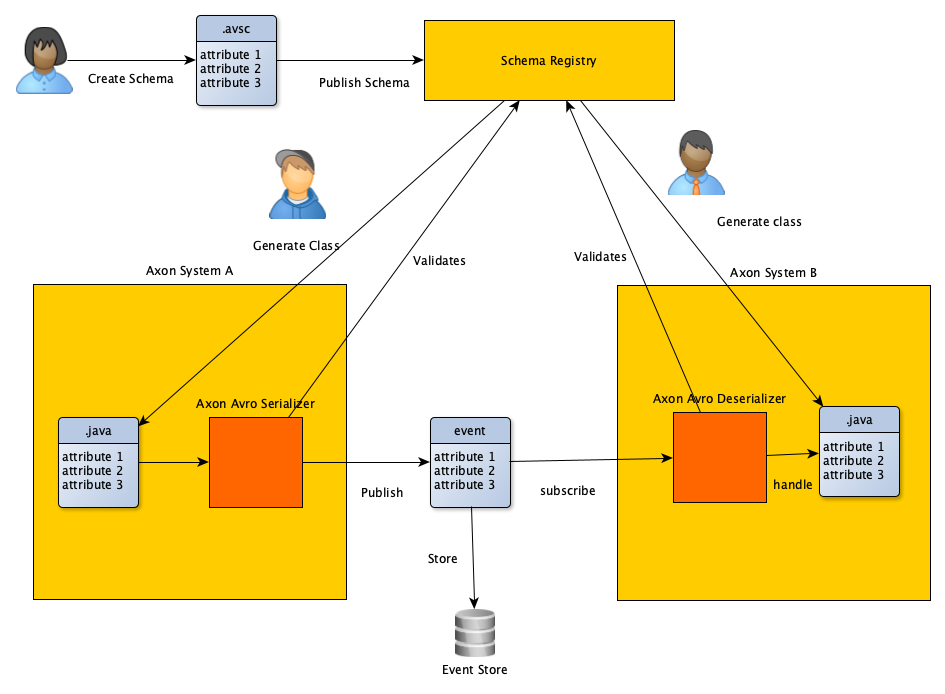

Apache Avro is a data serialization system based on **schemas**, defined in JSON. A schema is required to write data and to read data. In
particular, this means that Apache Avro is using a so-called schema-first approach. First, a schema is created and distributed, then it is
used to serialize the message and used again to deserialize the message back.

In general, the presence of the schema is sufficient to read and write data, but for statically-typed languages like Java or Kotlin, it is
common to generate static classes using Avro Code Generator.

Avro is flexible in where to get this schema from, so we defined
a [Schema Registry API](https://github.com/holixon/avro-registry-adapter/blob/develop/extension/api/src/main/kotlin/AvroSchemaRegistry.kt)
to de-couple the user from the implementation of the schema registry. This allowed us to define multiple interchangeable implementation of
the [registry adapters](../reference/registry-adapters.md).

The following figure demonstrates this approach:

