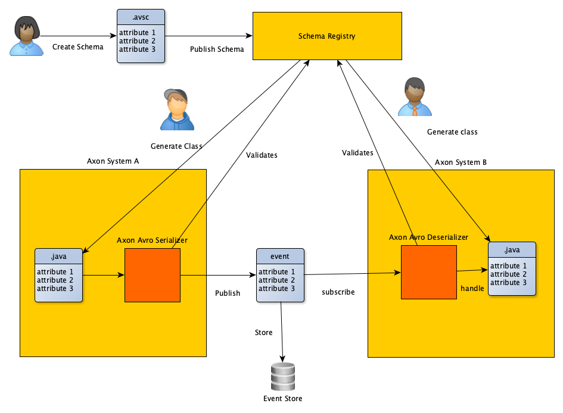

# Conceptual Layout

This diagram shows the different aspects that have to be covered 
by an avro serializer extension. It focuses on the aspect of events since this
is the core of a CQRS/ES system build with axon framwork, but basically applies
to all message types (command, query).



## Modelling the schema

Based on the business requirements for the events of our context, an avro schema definition
is created. It describes all properties of our event. 

Most importantly:

* a name (what happened. Meaningful in our context, example: `BankAccountCreated`)
* a namespace (in which context is this event relevant? could be our contexts name, example: `example.bankaccount.event`)
* a revision (when we later modify the event content, which is the revision we relate to, example: `1`)
* a reference id (to the business aggregate this event relates to, example: `bankAccountId`)

The schema can be identified by the URL of `namespace.name`, which will later also be the FQN of the (java) classes we use to create and handle the event instances.

_We consider that the namespace of the business context and the name of an event should not change over time when they are modelled properly in advance.
So it might be a good option not to force a typical java-package pattern on them, which would require renaming when refactorings are done._ 

The revision should be definied as a metadata of the schema, not a property inside.

Example:

```json
{
  "type": "record",
  "namespace": "example.bankaccount.event",
  "name": "BankAccountCreatedEvent",
  "fields": [
    {
      "name": "bankAccountId",
      "type": "string"

    },
    {
      "name": "initialBalance",
      "type": "int"
    }
  ],
  "revision": "1"
}

```    

## Publishing the schema

Once we are happy with our schema definition, we publish it to a schema registry.

* This extension should not enforce usage of a particular registry
 but instead provide flexible adapters and a mvp implementation for testing and dev (in memory, file based). The extension 
 will not implement a HA registry for production use.   
* The registry must be available at build and runtime because we need it for code generation and runtime validation/migration.
* might be a good option to check the schema registry API of popular vendors like confluent and apicur.io to get an idea of "needs to have" functionality.

## Implementing an event publishing system

To work with the axon framework, we need to have Java (or kotlin) classes
representing the model defined in the schema.
This class should best be generated from the schema, not written manually, to avoid errors on field names, required fields and so on.

So the build environment must have access to the schema (registry) and use a build system plugin (maven, gradle) to generate
java/kt source files.

Note: The class FQN will suffice to identity the published schema, but for the axon default upcasters to work,
we need a `@Revision` annotation on the class file, this will require customizing 
the generator/the generator templates. 

Programming the command - commandHandler - aggregateLifecycle.apply chain to publish the events
based of state changing intents will not feel any different than when using
regular event classes.

### Serializing 

To use avro-serialization, we have to register a serializer for the axon eventbus.
This requires implementing the `org.axonframework.serialization.Serializer` interface declared in `axon-messaging`.

Note: with spring autoconfiguration, axon allows setting the serializers via `application.yml`. At least for spring environments we will have to provide something similar.
 
The serializer receives the event instance of the generated class (s.a.). It then:

* validates, if the instance fulfills the requirements (structure, required fields) defined in the schema. For this it needs to:
  * determine schema URL and revision based on class meta data
  * load the schema from the registry (and probably cache it)
* create a serializedType. Question: avro provides byte sequence as target format. This consumes less space but is not readable. We need to figure out if we can transform the byte-sequence to json String on the fly when we need to analyze the event store (via axon server UI).
* the schema URL and revision have to be stored with the event. MetaData?
* note: this is "publisher" schema. A consumer might have a different schema revision (higher/lower), it is then up to avro to determine if the data is still compatible

### Deserializing

Since axon finds eventHandlers based on reflection and FQN, a system consuming events must also
keep a java/kt class based on (= generated from) the schema.
Since avro takes care of checking compatibility between publisher and receiver schema, this
does not have to be the same schema used to serialize the event.


TBC ....
  


